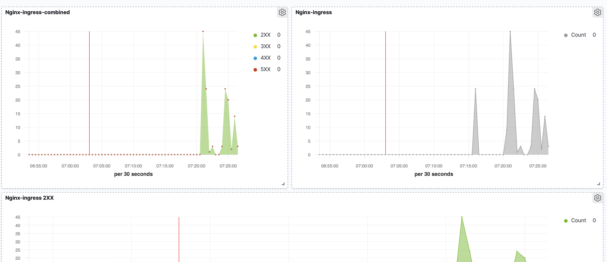
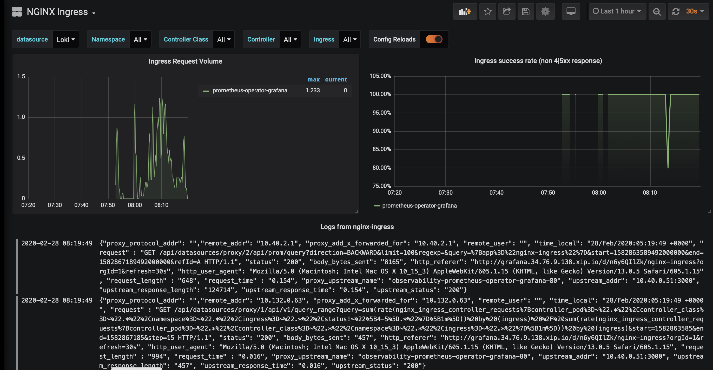

# ДЗ #9 Сервисы централизованного логирования для компонентов Kubernetes и приложений (лекция #10)

# Создание кластера
```bash
gcloud beta container --project "development-290213" clusters create "lab" --zone "europe-west1-b" --no-enable-basic-auth --cluster-version "1.17.12-gke.1504" --release-channel "regular" --machine-type "n1-standard-2" --image-type "COS" --disk-type "pd-standard" --disk-size "100" --metadata disable-legacy-endpoints=true --scopes "https://www.googleapis.com/auth/devstorage.read_only","https://www.googleapis.com/auth/logging.write","https://www.googleapis.com/auth/monitoring","https://www.googleapis.com/auth/servicecontrol","https://www.googleapis.com/auth/service.management.readonly","https://www.googleapis.com/auth/trace.append" --num-nodes "1" --no-enable-stackdriver-kubernetes --enable-ip-alias --network "projects/development-290213/global/networks/default" --subnetwork "projects/development-290213/regions/europe-west1/subnetworks/default" --default-max-pods-per-node "110" --no-enable-master-authorized-networks --addons HorizontalPodAutoscaling,HttpLoadBalancing --enable-autoupgrade --enable-autorepair --max-surge-upgrade 1 --max-unavailable-upgrade 0 && gcloud beta container --project "development-290213" node-pools create "infra-pool" --cluster "lab" --zone "europe-west1-b" --machine-type "n1-standard-2" --image-type "COS" --disk-type "pd-standard" --disk-size "100" --metadata disable-legacy-endpoints=true --node-taints node-role=infra:NoSchedule --scopes "https://www.googleapis.com/auth/devstorage.read_only","https://www.googleapis.com/auth/logging.write","https://www.googleapis.com/auth/monitoring","https://www.googleapis.com/auth/servicecontrol","https://www.googleapis.com/auth/service.management.readonly","https://www.googleapis.com/auth/trace.append" --num-nodes "3" --enable-autoupgrade --enable-autorepair --max-surge-upgrade 1 --max-unavailable-upgrade 0
```

# Установка HipsterShop

```bash
kubectl create ns microservices-demo
kubectl apply -f https://raw.githubusercontent.com/express42/otus-platform-snippets/master/Module-02/Logging/microservices-demo-without-resources.yaml -n microservices-demo
```

# Установка EFK стека

Добавим репозиторий с Helm charts
```bash
helm repo add elastic https://helm.elastic.co
```

```bash
kubectl create ns observability
helm upgrade --install elasticsearch elastic/elasticsearch --namespace observability
helm upgrade --install kibana elastic/kibana --namespace observability
helm upgrade --install fluent-bit stable/fluent-bit --namespace observability
```

## Установка elasticsearch в infra-pool

Для elasticsearch нужно добавит tolerations что scheduler мог их спланировать в infra-pool. Nodeselector нужен, чтобы scheduler их разместил только на нодах infra-pool.

```bash
helm upgrade --install elasticsearch elastic/elasticsearch --namespace observability -f kubernetes-logging/elasticsearch.values.yaml
```

Проверить, что все поды elasticsearch запустились на нодах infra-pool можно с помощью команды
```bash
kubectl get pods -n observability -o wide -l chart=elasticsearch
```

## Установим Prometheus
```bash
helm upgrade --install prometheus-operator stable/prometheus-operator --version=8.5.14 --namespace=observability -f kubernetes-logging/prometheus-operator.values.yaml
```

Установим Prometheus exporter
```bash
helm upgrade --install elasticsearch-exporter stable/elasticsearch-exporter --set es.uri=http://elasticsearch-master:9200 --set serviceMonitor.enabled=true --namespace=observability
```

## Установка nginx-ingress
```bash
kubectl create ns nginx-ingress
helm upgrade --install nginx-ingress stable/nginx-ingress --wait --namespace=nginx-ingress -f kubernetes-logging/nginx-ingress.values.yaml
```

Проверить где запустились поды nginx можно с помощью команды
```bash
kubectl get pods -n nginx-ingress -o wide
```

## Kibana

Получить внешний IP для сервиса можно с помощью команды
```bash
kubectl get services -n nginx-ingress
```

Обновляем релиз
```bash
helm upgrade --install kibana elastic/kibana --namespace observability -f kubernetes-logging/kibana.values.yaml
```

После обновления релиза стала доступна kibana по адресу kibana.<YOUR_IP>.xip.io

### Решение проблемы отсутсвия логов от fluent bit

Посмотреть логи можно с помощью команды
```bash
kubectl logs -n observability fluent-bit-qgzlz --tail 2 
```

Применим исправление
```bash
helm upgrade --install fluent-bit stable/fluent-bit --namespace observability -f kubernetes-logging/fluent-bit.values.yaml
```

# Мониторинг ElasticSearch

Протестирована работоспособность кластера в случае отключения одной и двух нод.
Ноды отключались с помощью команды kubectl drain *node_name* --ignore-daemonsets, а включались с помощью kubcetl uncordon *node_name*

## Сбор логов с nginx-ingress

Пропишем tolerations для fluent-bit чтобы он запускался на всех нодах кластера после этого появятся логи nginx.

Включен вывод логов в формате json.

## Kibana dashboard
Настроен дашборд для вывода количества обращений к nginx-ingress


# Loki

## Установка Loki и Promtail
```bash
helm upgrade --install loki loki/loki-stack --namespace=observability -f kubernetes-logging/loki.values.yaml
helm upgrade --install prometheus-operator stable/prometheus-operator --version=8.5.14 --namespace=observability -f kubernetes-logging/prometheus-operator.values.yaml
```

Настроена визуализация данных из Loki в Prometheus

