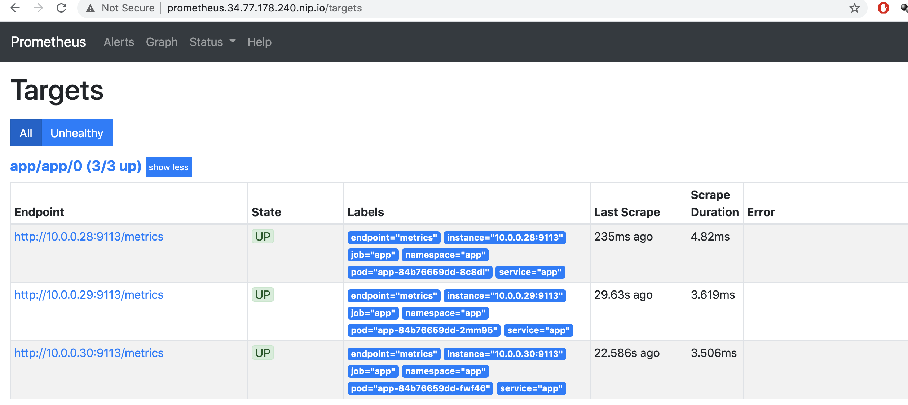

# ДЗ #8 к лекции #10 (kubernetes-monitoring)

## Создание кластера k8s
Для выполнения ДЗ использовал кластер kubernetes, развернутый в GKE.
```bash
gcloud beta container --project "development-290213" clusters create "cluster-1" --zone "europe-west1-b" --no-enable-basic-auth --cluster-version "1.17.9-gke.1504" --release-channel "regular" --machine-type "e2-medium" --image-type "COS" --disk-type "pd-standard" --disk-size "100" --metadata disable-legacy-endpoints=true --scopes "https://www.googleapis.com/auth/devstorage.read_only","https://www.googleapis.com/auth/logging.write","https://www.googleapis.com/auth/monitoring","https://www.googleapis.com/auth/servicecontrol","https://www.googleapis.com/auth/service.management.readonly","https://www.googleapis.com/auth/trace.append" --num-nodes "2" --enable-stackdriver-kubernetes --enable-ip-alias --network "projects/development-290213/global/networks/default" --subnetwork "projects/development-290213/regions/europe-west1/subnetworks/default" --default-max-pods-per-node "110" --no-enable-master-authorized-networks --addons HorizontalPodAutoscaling,HttpLoadBalancing --enable-autoupgrade --enable-autorepair --max-surge-upgrade 1 --max-unavailable-upgrade 0
```

## Установка prometheus-operator
Для установки prometheus-operartor использую helm3. Сервисы в интренет буду публиковать с помощью nginx-ingress.

Добавил репозитории с charts
```bash
helm repo add ingress-nginx https://kubernetes.github.io/ingress-nginx
helm repo add prometheus-community https://prometheus-community.github.io/helm-charts
helm repo update
```

### Установка nginx-ingress

Посмотреть актуальные версии можно с помощью команды:
```bash
helm search repo -l ingress-nginx/ingress-nginx
```

```bash
kubectl create ns nginx-ingress
helm upgrade --install nginx-ingress ingress-nginx/ingress-nginx --namespace=nginx-ingress --version=3.7.1
```
Смотрю IP адрес контроллера ingress, он пригодится для указания имен хостов публикуемых сервисов. Интересует external ip Load Balancer.
```bash
kubectl get service -n nginx-ingress
```

### Установка prometheus-operator

Проверяю последнюю версию prometheus-operator
```bash
helm search repo prometheus-community
```

Сохраняем стандартный файл values.yaml в качестве справки
```bash
helm inspect values prometheus-community/prometheus-operator --version=9.3.2 > kubernetes-monitoring/prometheus-operator.values.yaml.default
```
В файле prometheus-operator.values.yaml добавил описание Ingresses. В качестве имен использую сервис nip.io с указанием ранее найденого IP адреса ingress контроллера.
Кроме этого установил serviceMonitorSelectorNilUsesHelmValues в false (https://github.com/helm/charts/issues/11310#issuecomment-493525598)

Устанавил prometheus-operator
```bash
kubectl create ns monitoring
helm upgrade --install prometheus-operator prometheus-community/prometheus-operator --version=9.3.2 --namespace=monitoring -f kubernetes-monitoring/prometheus-operator.values.yaml
```
При уситановке получал сообщение info, что пропускаются CRD, к видимым последствиям это не привело. Как применить CRD до установки описано в статье https://github.com/helm/charts/tree/master/stable/prometheus-operator#coreos-crds

#### Проверка установки
По адресу grafana.*your_ip*.nip.io открывается Grafana. Стандартный пароль доступен в файле с переменными по умолчанию (adminPassword: prom-operator).
По адресу prometheus.*your_ip*.nip.io (на 80 порту) открывается prometheus. Alertmanager также открывается на 80 порту по адресу alertmanager.*your_ip*.nip.io

## Создал Docker образ

Создал Docker образ с добавлением stub_status по пути /stub_status на порту 8080. По пути / на порту 80 отдается hostname.
Dockerfile и файлы конфигурации nginx находятся в папке nginx-with-basic-status.

## Сбор метрик с nginx

### Развертывание приложения
```bash
kubectl create ns app
kubectl apply -f kubernetes-monitoring/deployment.yaml -n app
kubectl apply -f kubernetes-monitoring/service.yaml -n app
```
Node exporter запускается как sidecar контейнер.

#### Проверка работы сервиса
Получяем ip адрес сервиса с помощью команды kubectl get service -n app
Метрики сервиса проверим командой curl *service_ip_address*:9113/metrics

### ServiceMonitor

Servicemonitor настроаивал согласно статьи https://github.com/coreos/prometheus-operator/blob/master/Documentation/user-guides/getting-started.md

```bash
kubectl apply -f kubernetes-monitoring/servicemonitor.yaml -n app
```

#### Проверка сбора метрик
В prometheus появились новые targets.

